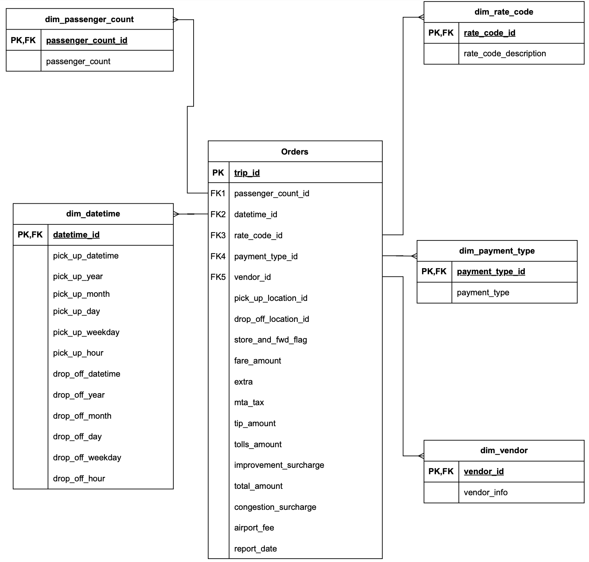
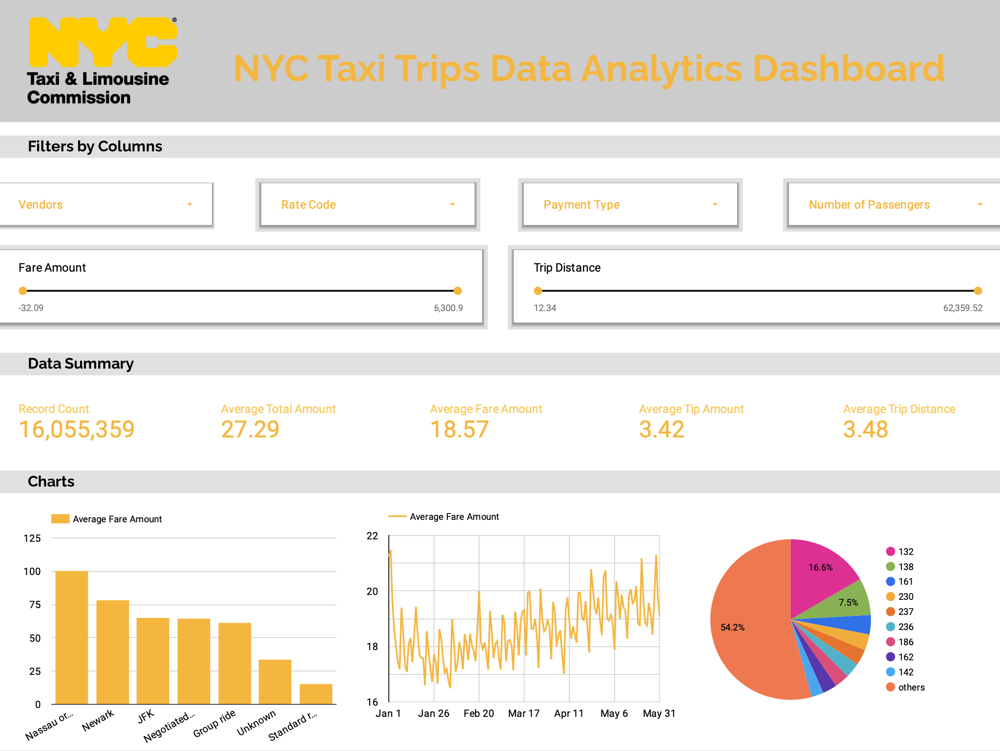

# NYC Taxi Data ETL Project

## Introduction

This project builds an end-to-end data engineering pipeline for analyzing taxi trips data in New York City from January 2023 to May 2023. The project repository composes of the raw data in partitioned parquet format, Python code files and notebook for the ETL pipelines in Mage, data model and architecture diagrams, Dockerfile and commands to run on GCP VM, SQL queries for analytics in BigQuery, and a screenshot of the final analytics dashboard in Google Looker.

## Project Architecture 

## Technology Used

- Programing Language: Python (PySpark)
- Big Data Tool: Apache Spark
- DevOps Tool: Docker
- Cloud Services: Google Cloud Storage, Google Cloud Compute Engine (VM Instances), BigQuery, Google Looker Studio
- ETL Pipeline: Mage (https://www.mage.ai/)

## The NYC TLC Dataset

The data set is publicly available in https://www.nyc.gov/site/tlc/about/tlc-trip-record-data.page. The webpage contains monthly trips data for yellow and green taxi in New York cities, and record information such as pick-up and drop-off time and location, trip distances, fare components, rate and payment types, etc. The downloaded datasets are in parquet formats. The data dictionary can be found at https://www.nyc.gov/assets/tlc/downloads/pdf/data_dictionary_trip_records_yellow.pdf.

## Star Schema

The transformation logic for the data mainly utilizes a star schema design to split the raw data into fact and dimension tables as presented in the below diagram.

## Dashboard

The data analytics dashboard is built in Google Looker by connecting to the BigQuery data warehouse in this project, as presented in the below screenshot.

